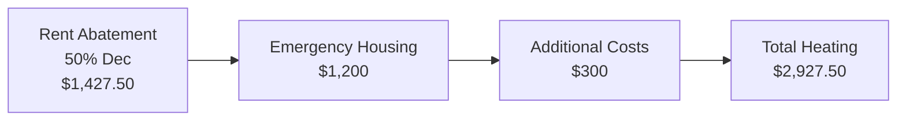

# Issue #2: Heating System Failure

## EMERGENCY: 51+ Hours Without Heat in Winter

### Critical Timeline

| Date/Time | Event | Status |
|-----------|-------|--------|
| Dec 9, 12:36 PM | Heating failure discovered | ❌ Emergency |
| Dec 10, Morning | Still no heat (24+ hours) | 🚨 CRITICAL |
| Dec 10, Multiple calls | Promised hotel, callbacks | ❌ NOT PROVIDED |
| Dec 10, Evening | Portable heaters delivered | ❌ BROKEN/INEFFECTIVE |
| Dec 11, Morning | 51+ hours no functional heat | 👶 CHILD ENDANGERED |
| Dec 11, 3:30 PM | "Wait for callback" | ❌ NO CALL |
| Dec 11, Evening | Child removed from home | 🚨 EMERGENCY |
| **Dec 13, 8 PM** | **Final settlement deadline** | ⏱️ 48 HOURS |

---

## Current Conditions

### Indoor Temperature

```
Indoor Temp: 57°F
Outdoor Temp: 38°F (day) / 32°F (night)
Duration: 51+ hours and counting
Status: UNINHABITABLE
```

### Property Conditions

- **Living Room**: 57°F
- **Master Bedroom**: 56°F
- **Child's Room**: 57°F
- **Kitchen**: 56°F
- **Outside (High)**: 38°F
- **Outside (Low)**: 32°F

### What 57°F Means

- **CDC Guidelines**: Prolonged exposure below 60°F poses health risks
- **Risk for 3-year-old**: Hypothermia, respiratory illness
- **Normal Home**: 68-72°F
- **Current**: 11-15°F below safe minimum for child
- **Duration**: 51+ hours in dangerous conditions

---

## The HVAC System Failure

### Vendor Assessment (A&W Heating and Cooling)

**FirstKey's Own Vendor Determination:**

- **System Manufactured**: 2001 (24 years old)
- **Parts Availability**: Extremely difficult to locate (obsolete)
- **Verdict**: **FULL REPLACEMENT REQUIRED**
- **Repair Status**: Awaiting FirstKey "approval"
- **Timeline**: Not provided

**Translation: The system is at end-of-life and needs complete replacement, not temporary fixes.**

---

## FirstKey's Failed Response

### The "Solution": Broken Portable Heaters

**What FirstKey Provided:**

1. **Heater #1**: Trips electrical breaker when plugged in
   - Creates fire hazard
   - Causes power loss to living/family rooms
   - **Result**: Cannot be used safely

2. **Heater #2**: Non-functional/broken
   - Doesn't heat
   - Sitting in corner unused
   - **Result**: No heating value

3. **Working Heater**: Has WiFi side effect
   - When plugged in: Trips electrical breaker
   - Causes WiFi to shut down
   - **Result**: Cannot work from home (software engineer)

### The Catch-22

**Montez Byrd (SVP, Software Engineer):**

- **Can't stay home**: WiFi goes out when heater is on (work impossible)
- **Can't go to office**: Waiting for contractor callbacks (never come)
- **Result**: Cannot work or be at office during critical SVP transition

**Family:**

- **Can't stay warm**: Heaters don't work or trip breaker
- **Can't have WiFi**: Heaters shut it down
- **Can't leave**: Waiting for repairs
- **Result**: Stuck in cold, disconnected home

---

## Broken Promises

### Timeline of Failures

| Date/Time | Promise | Promised By | Result |
|-----------|---------|------------|--------|
| Dec 10, evening | Hotel accommodation | FirstKey rep | ❌ NOT PROVIDED |
| Dec 10, late | "Call you tomorrow morning" | Multiple | ❌ NO CALL |
| Dec 11, morning | Jason Page will fix electrical | FirstKey | ❌ NEVER CONTACTED |
| Dec 11, 3:30 PM | "Update call today" | FirstKey rep | ❌ NO CALL |
| Dec 9-11 | "We're working on it" | Multiple | ❌ ONLY HEATERS OFFERED |

### Pattern of Bad Faith

**Customer Service as Psychological Warfare:**

1. **False Hope**: Promises with no intention to keep them
2. **Runaround**: Transfer between reps with no resolution
3. **Delays**: "Approval process" without timeline
4. **Inadequate Solutions**: Broken heaters offered as real fix
5. **Lack of Urgency**: Casual approach to child endangerment

---

## Impact on 3-Year-Old Child

### Physical Dangers

- **Cold Exposure**: 51+ hours at 57°F (11-15°F below safe)
- **Hypothermia Risk**: Prolonged cold can cause symptoms
- **Respiratory Risk**: Winter cold + indoor chill = illness risk
- **Sleep Disruption**: Cannot sleep comfortably at 57°F
- **Play Disruption**: Child cannot play normally in cold

### Behavioral Impact

**From Parents' Observations:**

- Asking repeatedly: "Why is our house so cold?"
- Wearing **winter coat indoors** (abnormal)
- Sleeping under **multiple blankets** (stressed)
- Cannot play or move freely
- Mood affected by constant discomfort

### Health Concerns

**CDC Guidelines on Cold Exposure:**

- Prolonged exposure at 57°F poses health risks to young children
- Respiratory illness more likely in cold homes
- Sleep quality impaired
- Stress hormones elevated from prolonged cold
- Vulnerability increases with age (3 is very young)

### Long-Term Consequences

- **Psychological**: Trauma from being in unsafe home
- **Health**: Increased illness susceptibility
- **Development**: Disruption during crucial development period
- **Relationship**: Family separated during holidays
- **Memory**: Child will remember being cold and uncomfortable

### Family Separation

**Decision Made: Child had to be removed from home**

- **Current Status**: Away from siblings' home
- **Duration**: Unknown (depends on repairs)
- **Family Separation**: During holiday season
- **Emotional Impact**: Holiday traditions destroyed
- **Logistics**: Arranging emergency childcare
- **Cost**: Emergency housing/childcare expenses

---

## Professional Impact (Montez Byrd - SVP, Bank of America)

### Career Context

- **Recent Promotion**: Senior Vice President (within months)
- **Critical Period**: First weeks/months crucial for credibility
- **Role Requirements**: High visibility, in-office presence, leadership
- **Timing**: Worst possible time for forced absences

### Work Disruptions

| Disruption | Time Lost | Career Impact |
|------------|-----------|---------------|
| Waiting for contractor calls | 20+ hours | Missing meetings |
| Cannot go to office (waiting) | 8+ hours | Visible absence from new role |
| Cannot work from home (WiFi) | 10+ hours | Productivity loss |
| Managing emergency/family | 5+ hours | Distraction from work |
| **Total Work Loss** | **43+ hours** | **Critical period damaged** |

### Meeting Cancellations

**During critical SVP transition:**

- Team meetings missed
- Leadership visibility compromised
- Professional credibility at risk
- Network building disrupted
- Cannot "show up" for new role

### Financial Consequences

- **SVP Compensation**: Often includes performance bonuses
- **Visibility Tied to Bonus**: New role requires visibility
- **Forced Absences**: Damage visibility metrics
- **Career Advancement**: Critical transition period disrupted
- **Estimated Damage**: $5,000-$10,000 in lost compensation/opportunities

### The Impossible Choice

**Montez faced a no-win situation:**

- **Option A: Stay home**
  - Avoid losing home (landlord might cause more damage)
  - Be present if repairs finally happen
  - **Cost**: Missing crucial work meetings, professional damage

- **Option B: Go to office**
  - Show visibility for new SVP role
  - **Cost**: Miss repair appointments, home unattended, family in cold

- **Option C: Attempt both**
  - WiFi disrupted when heaters plugged in
  - Cannot work from office or home
  - Forced absences anyway
  - **Result**: Worst of all options

---

## Legal Violations

### N.C.G.S. § 42-42 - Implied Warranty of Habitability

**The Law:**
> "A landlord shall provide fit premises... capable of being heated to 68°F"

**FirstKey's Violation:**
- Failed to maintain heating system
- 57°F = NOT FIT for habitation
- NOT capable of 68°F requirement
- Landlord must ensure basic warmth

**For Child:**
- Extra protection for tenant under 18
- Landlord had duty to ensure safe temperature for child
- 51+ hours in 57°F = breach of duty

### N.C.G.S. § 42-38 - Landlord Duty to Maintain

**The Law:**
> "A landlord shall keep and maintain in good working order and promptly repair all... heating... and other equipment."

**FirstKey's Violations:**
- Failed to keep heating working
- Did NOT promptly repair (51+ hours)
- 24-year-old system needed replacement
- Offered inadequate temporary solution
- No timeline for replacement

### Emergency Repair Standard

**NC law provides:**
- Landlords must make emergency repairs immediately
- Lack of heating in winter = emergency
- 51+ hours = clearly not promptly
- Broken portable heaters = not adequate solution
- Vendor confirmed replacement needed = landlord knows correct fix

### N.C.G.S. § 75-1.1 - Unfair and Deceptive Practices

**FirstKey's Violations:**
- **False promises**: Hotel, callbacks, repairs
- **Inadequate response**: Offered broken heaters as solution
- **Ignored vendor report**: Knew replacement needed, offered temporary fix
- **Delay tactics**: "Approval process" without timeline
- **Knowing endangerment**: Continued delay despite child in home

**Remedy: Treble (3x) damages**

### Child Endangerment

**Possible Claims:**

- Knowingly allowed child in 57°F home
- Refused safe alternative (hotel)
- Offered insufficient temporary solution
- Delayed emergency repair
- Prioritized "approval process" over child safety

---

## Documentation

### Temperature Records

✅ **Daily log**: Temperature readings all rooms, morning/evening
✅ **Outdoor temps**: Weather data corroboration
✅ **Date/time stamped**: Shows duration of cold exposure
✅ **Multiple rooms**: Shows system-wide failure
✅ **Time-lapse**: Shows temperature not recovering

### Visual Evidence

✅ **Thermostat photos**: Showing 57°F
✅ **Child in winter coat**: Inside home
✅ **Multiple blankets**: On beds/furniture
✅ **Heaters**: Photos of broken/tripped
✅ **Electrical panel**: Showing breaker tripped
✅ **Date/time stamps**: On all images

### Communication Record

✅ **Phone calls**: Dates, times, durations, participants
✅ **Emails**: All correspondence documented
✅ **Voicemails**: Promises recorded
✅ **Text messages**: Screenshots of all messages
✅ **Contact log**: Representative names and broken promises

### Professional Impact Documentation

✅ **Work calendar**: Showing meeting cancellations
✅ **Emails**: About absences to leadership
✅ **Feedback**: From colleagues/leadership about visibility
✅ **Compensation impact**: Documentation of potential bonus loss

### Vendor Documentation

✅ **A&W Heating report**: System from 2001, needs replacement
✅ **Inspection findings**: Parts unavailable, obsolete
✅ **Timeline**: For replacement (pending FirstKey approval)
✅ **Quote**: Cost of replacement

---

## Damages Calculation

### Heating Failure-Specific Damages



### Breakdown

1. **Rent Abatement**: $1,427.50
   - 50% of December rent for 13+ days without heat
   - Property uninhabitable (57°F)
   - 51+ hours documented
   - Percentage justified: complete system failure

2. **Emergency Housing**: $1,200
   - Child had to be removed from home
   - Emergency accommodation costs
   - Estimated for 1 night emergency housing

3. **Additional Costs**: $300
   - Winter clothing/supplies
   - Electricity for temporary solutions
   - Travel/transportation

**Heating Issue Total Damages: $2,927.50**

### Child Endangerment Component

**Additional Damages Specific to Child:**

- Health risk (hypothermia, illness): $3,000
- Emergency removal necessity: $2,000
- Trauma/stress from unsafe conditions: $2,000
- Holiday disruption: $1,500
- Medical monitoring: $500
- **Child Total: $9,000** (covered in child damages section)

### Professional Impact Component

**SVP Career Damage:**

- Lost meeting participation: $1,500
- Professional credibility damage: $2,000
- Visibility impact on bonus: $3,000
- Network building disruption: $2,500
- **Professional Total: $9,000** (covered in professional damages)

---

## NC Building Code Violations

### International Property Maintenance Code

**Section 602.3 - Heating Systems:**
- Must be capable of maintaining 68°F during winter
- 57°F = clear violation
- Landlord must ensure compliance

**Section 505.1 - Plumbing:**
- Must be maintained safely
- Related electrical systems must not be hazardous
- Broken heaters + electrical issues = violation

**Section 605.1 - Electrical:**
- Must handle normal operation of appliances
- Breaker constantly tripping = hazard
- Fire risk from overloaded circuits

### Charlotte-Mecklenburg Specific

**Local Heating Requirements:**
- Minimum 68°F capability required
- Must be maintained by landlord
- Repairs must be prompt
- Emergency repairs = immediate

---

## Current Status

**As of December 11, 2025:**

- ❌ Heat: STILL NOT FIXED (51+ hours)
- ❌ Temporary solution: INADEQUATE (broken heaters)
- ❌ Repair timeline: NEVER PROVIDED
- ❌ HVAC replacement: PENDING FirstKey "approval"
- ✅ Vendor assessment: COMPLETE (replacement needed)
- ✅ Child safety: COMPROMISED (removed from home)
- ✅ Documentation: COMPREHENSIVE
- ✅ Case strength: VERY STRONG

---

## Legal Strength

### Slam-Dunk Legal Case

**No reasonable argument FirstKey can make:**

1. ✅ Heating broken for 51+ hours (documented)
2. ✅ 57°F is uninhabitable (objective fact)
3. ✅ Landlord knew problem (vendor report)
4. ✅ Landlord knew solution (replacement needed)
5. ✅ Landlord offered inadequate solution (broken heaters)
6. ✅ Child endangered (removed from home)
7. ✅ Multiple broken promises (documented)
8. ✅ No timeline provided (still unknown)

**FirstKey liability is certain.**

### Jury Appeal

**Extremely sympathetic facts:**

- ✅ Perfect 3-year-old child in cold home
- ✅ Professional parents (SVP at major bank)
- ✅ Perfect payment history (3 years)
- ✅ Clear bad faith (vendor report ignored)
- ✅ Multiple broken promises
- ✅ Holiday season timing (added emotional impact)
- ✅ Emergency situation (51+ hours)

**Jury will be sympathetic to tenants.**

---

## Next Steps

### Immediate (Today/Tomorrow)

1. **Final Demand Letter**
   - Emphasize heating emergency
   - Detail broken promises
   - Cite child endangerment
   - Set 48-hour deadline

2. **Evidence Documentation**
   - Complete temperature logs
   - Final photos/videos
   - Back up all documentation
   - Organize for potential litigation

3. **Rent Escrow**
   - Place December rent in escrow
   - Send formal notice to FirstKey
   - Document the escrow account

### If Settlement Rejected

1. **Immediate Legal Action**
   - File lawsuit Dec 16
   - Request treble damages
   - Include child endangerment claim
   - Seek emergency injunctive relief for repairs

2. **Regulatory Complaints**
   - Code Enforcement (heating violation)
   - Fire Marshal (electrical hazard)
   - NC Real Estate Commission (professional negligence)

3. **Media Contact**
   - "SVP at Bank of America forced to remove child from home due to landlord negligence"
   - Strong media angle (sympathetic family + major bank connection)

---

## Takeaway

The heating failure demonstrates FirstKey's **complete disregard for tenant safety**:

- **Emergency ignored**: 51+ hours without heat in winter
- **Child endangered**: 3-year-old in 57°F home
- **Solution inadequate**: Broken heaters offered instead of real fix
- **Promises broken**: Hotel, callbacks, repairs all unfulfilled
- **Delays inexplicable**: "Approval process" while family suffers
- **Vendor ignored**: Knew replacement needed but offered temporary fix

**This is the most compelling part of the case for a jury.**

Combined with the 5-month water leak, this shows a pattern of:
- Systematic neglect
- Bad faith customer service
- Prioritizing cost over tenant safety
- Making promises to buy time while doing nothing
- Knowing the correct fix but avoiding it

**This justifies treble damages under NC's Unfair Trade Practices Act.**

---

## Quick Links

- [Executive Summary](/docs/01-overview/executive-summary)
- [Water Leak](/docs/01-overview/water-leak)
- [Legal Violations](/docs/02-legal/violations)
- [Damages Calculation](/docs/04-damages/calculation)
- [Timeline](/docs/03-timeline/heating-timeline)
