# Issue #3: Water Leak

## **Overview**

:::caution Timeline
- **Start Date** 09/19/2025
- **End Date** Ongoing (73 Days)
:::

:::tip Shareholders
- Shana Shuford
- Kevin Walls
- Jason Shokunbi
- Mariola Schubbe 
- Hazel Aying
- India Pritchett
- Aurora Elliott
- Montier Elliott
  - 332.600.9573
  - montier.elliott@gmail.com
- Nia-Tara Hall-Byrd
  - 704.713.2422
  - nthall776@gmail.com
- **Vendors:** Swift Bros
- **Vendors:** Charlotte Plumbing
:::

### **Problem Statement**

Since the date July 1, 2025 the water utilities were transferred into the our name, the monthly water usage at the property increased dramatically and abnormally. Multiple First Key Homes representatives and several vendors have inspected the home, each one confirming evidence of a **water leak on the property's supply line**. Despite these confirmations, the issue has not been fully resolved, and we have incurred significant financial impact due to elevated water bills.

:::caution
Under **North Carolina landlord-tenant law (N.C.G.S. § 42-42(a)(2))**, the landlord must:

> **"Make all repairs and do whatever is necessary to put and keep the premises in a fit and habitable condition."**

A prolonged underground waterline leak is a **habitability and maintenance issue**, and failure to fix it promptly shifts financial burden unlawfully to us.
:::

**We need the following:**

1. **Written confirmation from a licensed plumber** that the leak is fully resolved, including the location and method of repair.
2. **A full correction and concession** of all excessive water charges resulting from the unresolved leak.
3. **Status update on the remaining credit balance** owed by First Key Homes.


<!--  -->
<!--  -->

## **Water Bills**

* **Average bill before July 1, 2025:** **$54.75/month**
* **Bills after leak detection period:**
  * July 1–Aug 8: **$372.74**
  * Aug 8–Sept 8: **$219.37**
  * Subsequent months continue to show elevated use

This represents increases as high as **291% month-over-month**.

<!-- $$
\begin{array}{l|r|r}
\textbf{Period} & \textbf{Amount (\$)} & \textbf{\% \Delta \text{ vs prev}} \\
\hline
\text{10/24} & 23.20 & - \\
\text{11/24} & 32.18 & +38.71\% \\
\text{12/24} & 25.50 & -20.76\% \\
\text{1/25} & 43.49 & +70.55\% \\
\text{2/25} & 42.98 & -1.17\% \\
\text{3/25} & 61.22 & +42.44\% \\
\text{4/25} & 85.00 & +38.84\% \\
\text{5/25} & 83.98 & -1.20\% \\
\text{6/25} & 95.18 & +13.34\% \\
\text{7/1/25 - 8/8/25} & 372.74 & +291.62\% \\
\text{8/8/25 - 9/8/25} & 219.37 & -41.15\% \\
\hline
\textbf{Average (before\ 7/1/25)} & \textbf{54.75} & \text{---} \\
\end{array}
$$ -->

### **July 9th 2025**

**[PDF - Water Bill: July 9th 2025](../../static/water/3017WaterCharges7-1-25-7-9-25.pdf)**

<!--  -->

### **August 9th 2025**

**[PDF - Water Bill: August 9th 2025](../../static/water/3017WaterCharges7-9-25-8-8-25.pdf)**

<!--  -->

### **September 8th 2025**

**[PDF - Water Bill: September 8th 2025](../../static/water/3017WaterCharges8-8-25-9-8-25.pdf)**

<!--  -->

### **October 8th 2025**

**[PDF - Water Bill: October 16th 2025](../../static/water/3017WaterCharges8-8-25-10-15-25.pdf)**

<!--  -->

## **Communications**


- :email: August 4th 2025 - 24 minutes
- :phone: September 29th 2025 - 10 minutes
- :email: October 7th 2025 - Email
- :phone: October 9th 2025 
  - :phone: 8 minutes 
  - :email: Follow-up Shana Shuford Email
- :email: October 9th 2025 - Shana Shuford Email
- :phone: October 29th 2025 - 15 minutes 
- :phone: October 30th 2025 - Mariola Schubbe
  - :phone: 10:53 26 minutes
  - :phone: 11:42 53 minutes
  - :phone: 12:42 10 minutes   
- :email: October 30th 2025 - Email
- :phone: November 4th 2025 - Hazel Aying
- :phone: November 17th 2025 
  - :phone: 16 minutes
  - :email: Follow-up Email
- :phone: November 18th 2025 - 16 minutes
- :phone: November 19th 2025 - 10 minutes
- :phone: November 25th 2025 - 8 minutes
- :phone: December 1st 2025 - 19 minutes

### **Communication Timeline**

```mermaid
flowchart TD

    A1[📧 August 4, 2025<br/>24 min]

    B1[📞 September 29, 2025<br/>10 min]

    C1[📧 October 7, 2025<br/>Email]

    D1[📞 October 9, 2025]
    D1a[📞 8 min]
    D1b[📧 Follow-up<br/>Shana Shuford Email]

    E1[📧 October 9, 2025<br/>Shana Shuford Email]

    F1[📞 October 29, 2025<br/>15 min]

    G1[📞 October 30, 2025<br/>Mariola Schubbe]
    G1a[📞 10:53<br/>26 min]
    G1b[📞 11:42<br/>53 min]
    G1c[📞 12:42<br/>10 min]

    H1[📧 October 30, 2025<br/>Email]

    I1[📞 November 4, 2025<br/>Hazel Aying]

    J1[📞 November 17, 2025]
    J1a[📞 16 min]
    J1b[📧 Follow-up Email]

    K1[📞 November 18, 2025<br/>16 min]

    L1[📞 November 19, 2025<br/>10 min]

    M1[📞 November 25, 2025<br/>8 min]

    N1[📞 December 1, 2025<br/>19 min]

    %% Flow sequence
    A1 --> B1 --> C1 --> D1
    D1 --> D1a --> D1b
    D1 --> E1 --> F1 --> G1
    G1 --> G1a --> G1b --> G1c
    G1 --> H1 --> I1 --> J1
    J1 --> J1a --> J1b
    J1 --> K1 --> L1 --> M1 --> N1

```


<details>

<summary>Communication Timeline</summary>



</details>

## **Visits**

### **1. First Key Homes – Kevin Walls (Visit 1)**

* Confirmed leak at meter
* Directed us he would call plumber
* No repair completed

### **2. Charlotte Plumbing – SME Mike**

* Confirmed leak at meter
* Cut into wall to inspect HVAC area
* Found **no interior leaks**
* Recommended waterline inspection (underground)

### **3. Swift Bros – SME Mykola (Visit 1)**

* Confirmed leak at meter
* Turned off main valve
* Inspected crawl/under house: **no interior leak**
* Recommended waterline evaluation

### **4. First Key Homes – Kevin Walls (Visit 2)**

* Incorrectly reported water continued after shutoff
* Suggested replacing toilet components
* Created confusion due to contradictory findings
* Not aligned with licensed plumber findings

<details>

  <summary>Request History</summary>

<!--  -->
</details>


### **5. Swift Bros – SME Mykola (Visit 2)**

* Replaced main valve to the home
* Leak persisted
* Confirmed again **no internal leak**

### **6. Last Vendor (Unidentified)**

* Arrived with excavator
* Did not identify himself or provide scope
* Began excavation on property
* Provided no update, no findings, and no written report

### **7. First Key Home Visit**

* We Visited First Key Homes to discuss the water leak issue with Mariola Schubbe.
* 
* **Explained we needed the following questions answers:**
   - Written confirmation from a licensed plumber that the leak is fully resolved, including the location and method of repair.
   - A full correction and concession of all excessive water charges resulting from the unresolved leak.
   Status update on the remaining credit balance owed by First Key Homes.

:::caution
All professional vendors located the issue **outside** the house. No one has provided written confirmation of repair or a final diagnosis, which NC law requires the landlord to provide to resolve habitability concerns.
:::

## **State of Union**

### **1. Licensed Plumber Verification (Mandatory)**

Provide a **written statement** from a licensed plumber confirming:

* The exact cause and location of the leak
* The work performed to repair the leak
* Confirmation that the leak is fully resolved
* Baseline water usage has returned to normal levels


### **2. Billing Concessions & Adjustments**

Issue a full concession for all excessive water usage from **July 1, 2025 through the date the leak is confirmed resolved**.

This includes:

* Water charges
* Sewer charges
* Stormwater charges
* Any late fees arising from inflated bills

### **3. Outstanding Credit Payment**

Confirm when the remaining **$477.16** credit will be applied to the tenant’s account.

:::danger **Expenditures**

- Per **Mariola Schubbe** we was suppose to be credited `$1,161.41` towards our rent for the water leak issue. We have only received `$684.25` to date.
- Per **Mariola Schubbe** we was suppose to have no late fees charged due to the water leak issue. We was charged a late fee on our November rent. This issue was resolved after contacting **Hazel Aying**.

---

- **Promised** $1,161.41
- **Paid** $684.25
- **Balance** $477.16
:::


## Timeline: July 2025 - Present (5+ Months)

### Summary

A water leak at the property has caused dramatic increases in utility bills and remains completely unresolved after 5+ months and multiple service calls. FirstKey promised a $1,161.41 credit for the excess charges but has only paid $684.25, leaving $477.16 outstanding.

---

## The Crisis in Numbers

### Utility Bills - 580% Increase

**Monthly Water Bill History:**

| Month | Amount | Change | Excess | Status |
|-------|--------|--------|--------|--------|
| Pre-July Average | $54.75 | — | $0 | Normal |
| **July 2025** | **$372.74** | **+580%** | **$317.99** | 🚨 SPIKE |
| August 2025 | $219.37 | -41% | $164.62 | Still High |
| Sept-Dec (est) | ~$150/mo | Declining | $500+ | Leak Unresolved |
| **5-Month Total** | — | — | **$982.61+** | Excess |

### Credit Issues

**FirstKey's Promise vs. Reality:**

| Item | Promised | Delivered | Outstanding |
|------|----------|-----------|-------------|
| Water Bill Credit | $1,161.41 | $684.25 | **$477.16** |
| Date Promised | Oct 30, 2025 | Partial Nov | Still Owed |
| Reason Given | None | "In system" | No explanation |

### What This Means

- **Tenants paid**: ~$1,500 in excess water charges
- **FirstKey owes**: $477.16 (still unpaid as of Dec 11)
- **Leak status**: STILL NOT FIXED after 5+ months
- **Impact**: 5+ months of financial stress and uncertainty

---

## Financial Impact on Tenants

### Direct Financial Costs

```
Total Excess Water Charges: $982.61
Less: Credit Received: ($684.25)
─────────────────────────
Still Owed by FirstKey: $477.16

Plus: Estimated unpaid months
      (Sept-Dec): ~$500
─────────────────────────
Total Financial Impact: ~$1,500+
```

### Impact Beyond Money

- **Constant Monitoring**: Had to track every water bill, fearing new spikes
- **Communication Burden**: Dozens of hours on phone/email
- **Mental Anxiety**: Ongoing stress about mounting bills
- **Trust Destroyed**: Multiple promises about credits broken
- **Uncertainty**: No timeline for when leak will be fixed

---

## FirstKey's Failed Response

### Service Calls

| Call # | Date | Action Taken | Result | Notes |
|--------|------|------------|--------|-------|
| 1 | July | Initial diagnosis | ❌ Not fixed | Problem identified |
| 2 | Aug | Follow-up visit | ❌ Not fixed | Continued bills |
| 3 | Sept | Another attempt | ❌ Not fixed | Pattern emerges |
| 4 | Oct | More service calls | ❌ Not fixed | No resolution |
| 5+ | Nov-Dec | Multiple visits | ❌ Not fixed | 5+ months with leak |

**Result: Multiple service calls, ZERO repairs**

### Broken Promises

| Promise | Timeline | Result |
|---------|----------|--------|
| Credit of $1,161.41 | Made Oct 30 | ❌ Only $684 paid |
| "Full amount will be credited" | Promised | ❌ $477 still owed |
| "In system for processing" | Stated | ❌ Never completed |
| Leak repair timeline | Never provided | ❌ Still unresolved |
| Explanation for shortfall | Not offered | ❌ Still waiting |

---

## Legal Violations

### N.C.G.S. § 42-42 - Implied Warranty of Habitability

**The Law:**
> "A landlord shall provide fit premises and shall make all repairs necessary to keep the premises fit and habitable."

**FirstKey's Violation:**
- Failed to maintain functional plumbing for 5+ months
- Leak makes property not reasonably suited for occupancy
- Essential service (water) affected by poor maintenance

**Tenant Remedies:**
- Withhold rent until repair
- Terminate lease
- Sue for damages and rent abatement

### N.C.G.S. § 42-38 - Landlord Duty to Maintain

**The Law:**
> "A landlord shall keep and maintain in good working order and promptly repair all electrical, plumbing, heating, ventilating, air conditioning and other equipment."

**FirstKey's Violation:**
- Failed to keep plumbing in good working order
- Did NOT make prompt repairs
- 5+ months is unreasonably delayed
- Multiple service calls show they knew of problem

### N.C.G.S. § 75-1.1 - Unfair and Deceptive Trade Practices

**The Law:**
> "Unfair methods of competition and unfair or deceptive acts or practices... are unlawful."

**FirstKey's Violations:**
- **False Promise**: Promised $1,161.41 credit
- **Deceptive Action**: Only paid $684.25 with no explanation
- **Pattern**: Multiple broken communications about repairs
- **Remedy**: **Treble (3x) damages available**

### Breach of Contract

The lease requires:
- "Premises maintained in habitable condition"
- "All utilities in working order"
- FirstKey violated these express terms

### Unjust Enrichment

FirstKey:
- Allowed leak to continue while collecting rent
- Tenant paid for water caused by landlord's negligence
- FirstKey owes refund of excess charges ($982.61)
- Must pay promised credit ($477.16)

---

## Impact on Tenants

### Financial Stress

**Month by Month Anxiety:**
- July: "Why is bill $372? What's happening?"
- August: "Bill still high! Is leak getting worse?"
- September: "No fix yet? How many months will this last?"
- October: "Promised credit finally! But not full amount."
- November: "Still waiting for rest of credit..."
- December: "Now heating's broken too. This is too much."

### Time and Effort

- **Dozens of phone calls**: To FirstKey representatives
- **Multiple emails**: Requesting updates and explaining situation
- **Research time**: Looking up tenant rights
- **Emotional labor**: Managing stress of ongoing issue
- **Estimated hours**: 15-20+ hours spent on water leak alone

### Loss of Trust

- Can't trust FirstKey to keep promises
- Doesn't believe repairs will actually happen
- Fears of additional hidden problems
- Worry about whether full credit will ever be paid
- Anxiety about future property maintenance

### Physical/Health Impact

- **Sleep disruption**: Worrying about bills
- **Stress symptoms**: Tension, headaches
- **Relationship strain**: Ongoing home issues create tension
- **Mental health**: Anxiety about financial obligations

---

## Documentation

### Evidence Collected

✅ **Water bills**: July 2024-December 2025 (shows normal, then spike)
✅ **Correspondence**: All emails with FirstKey about leak
✅ **Phone records**: Dates/times of calls about repair
✅ **Credit agreements**: Documentation of promised $1,161.41
✅ **Payment records**: Proof of only $684.25 received
✅ **Service calls**: Dates and descriptions of visit attempts
✅ **Vendor communications**: Contractor notes from service visits

### Contact Log

**Representatives Contacted:**

- Shana Shuford - Multiple interactions about leak
- Kevin Walls - Investigation of water issue
- Mariola Schubbe - Credit discussion (Oct 30, 89 minutes!)
- Hazel Aying - General follow-up
- India Pritchett - Case management
- Jason Shokunbi - Additional follow-up

**All contacts documented with date, time, duration, and result**

---

## Damages Calculation

### Water Leak-Specific Damages


### Breakdown

1. **Excess Water Charges**: $982.61
   - What tenants paid vs normal bills

2. **Outstanding Credit**: $477.16
   - Still owed by FirstKey

3. **Rent Abatement (6 months @ 25%)**: $4,282.50
   - Premises partially unhabitable due to water issues
   - Justifies 25% rent reduction for 6 months

**Water Issue Total Damages: $5,742.27**

### Why Rent Abatement Applies

North Carolina law allows rent abatement when:
- Landlord fails to maintain habitable conditions
- Defect materially affects use and enjoyment
- Tenant provided notice and landlord failed to repair

**Water leak qualifies:**
- ✅ 5+ months without repair = failure
- ✅ High bills and water issues = material defect
- ✅ Multiple notices given = landlord knowledge
- ✅ Repeated non-performance = landlord failure to remedy

### Treble Damages for Unfair Practices

Under N.C.G.S. § 75-1.1:
- **Base damages**: $5,742.27
- **Treble multiplier**: × 3
- **Total treble available**: $17,226.81

**Justification for treble:**
- Deliberately withheld promised credit ($1,161 promised, $684 paid)
- Pattern of broken promises about repairs
- Used "approval process" as delay tactic
- No reasonable explanation for credit shortfall
- 5+ months shows willful neglect

---

## Current Status

**As of December 11, 2025:**

- ❌ Leak: STILL NOT FIXED (5+ months)
- ❌ Outstanding credit: STILL NOT PAID ($477.16)
- ❌ Repair timeline: NEVER PROVIDED
- ❌ Explanation for shortfall: NEVER GIVEN
- ✅ Documentation: COMPLETE
- ✅ Case for damages: STRONG

---

## Next Steps

### Immediate (This Week)

1. **Final Demand Letter**
   - Cite water leak as continuing violation
   - Demand $477.16 outstanding credit
   - Include in settlement demand

2. **Prepare Evidence**
   - Organize water bills
   - Compile communication log
   - Back up all documentation

### If Settlement Rejected

1. **Include in Lawsuit**
   - Water damages as part of larger case
   - Include treble damages claim
   - Reference all broken promises

2. **File Code Enforcement Complaint**
   - Plumbing code violations
   - Landlord failure to maintain
   - Request inspection and citations

---

## Takeaway

The water leak demonstrates FirstKey's **pattern of failure**:

- **5+ months** without resolving essential service
- **Multiple service calls** with no results
- **Broken promise** regarding credit ($1,161 promised, $684 paid)
- **No timeline** ever provided for fix
- **No explanation** for credit shortfall

This pattern, combined with the heating emergency, shows a property management company that:
- Makes promises without intention to keep them
- Uses delays as a tactic
- Avoids direct communication about problems
- Places tenant cost burden on tenants rather than fixing issues

**This strengthens the case for treble damages under the Unfair Trade Practices Act.**

---

## Quick Links

- [Executive Summary](/docs/01-overview/executive-summary)
- [Heating Failure](/docs/01-overview/heating-failure)
- [Legal Violations](/docs/02-legal/violations)
- [Damages Calculation](/docs/04-damages/calculation)
- [Timeline](/docs/03-timeline/water-leak-timeline)
