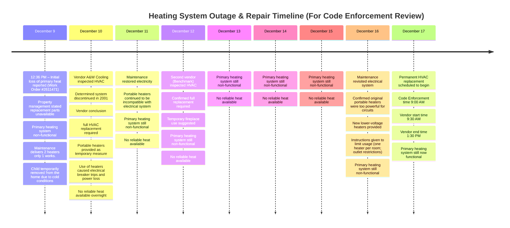
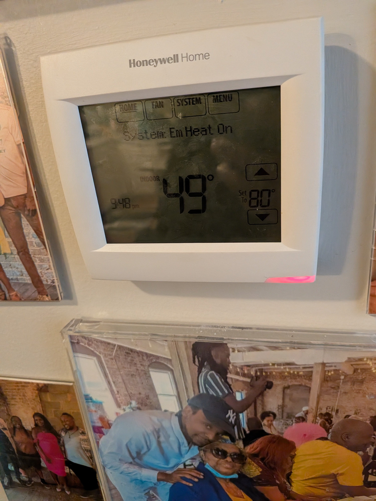
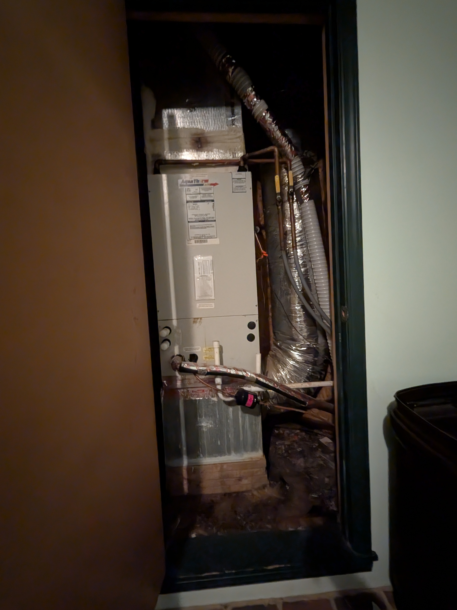

# Code Enforcement

## Overview

Our main heating system has been out for several days. The temporary heaters provided caused electrical issues, and permanent repairs are now scheduled.

:::danger **GIST**
- The primary heating system hasn't been working since 12/09/2025 12:36 PM.
- The portable heaters caused breakers to trip.
- Maintenance later confirmed the heaters were too powerful for the electrical system.
- Permanent repairs are now scheduled to begin.
:::

### Current Status

:::info Repair Status

- Vendor (Benchmark) confirmed start date and time of
  December 17, 8:30 AM
  :::

## Timeline

- **December 9**

  - Heat stopped working.
  - Maintenance indicated parts were unavailable and would need to be ordered.
  - Home became uninhabitable due to cold; **child was temporarily removed from the home**.

- **December 10**

  - Vendor **A&W Cooling** confirmed the unit was **discontinued in 2001**, requiring full replacement.
  - Temporary heaters were provided.
  - Temporary heaters caused **electrical issues**, including breaker trips.
  - Emergency maintenance requests were made; **no heat overnight**.

- **December 11**

  - Maintenance restored electricity, but **heat remained unavailable**.

- **December 12**

  - Second vendor (**Benchmark**) confirmed **full HVAC replacement required**.
  - No permanent heat restored.

- **December 13–15**

  - Home continued to have **no reliable heat**.

- **December 16**

  - Maintenance acknowledged the previously provided heaters were **too powerful for the electrical system**.
  - New heaters with lower voltage were provided.
  - Maintenance instructed:

    - Only **one heater per room**
    - **Do not use certain outlets**

- **December 17**

  - Permanent HVAC replacement scheduled to begin this morning.

## Assessment Details

### Heating

- Thermostat (current temp + inability to maintain normal heat)
- HVAC unit (if accessible)
- Confirmation that primary heat is non-functional

### Temporary Heaters

- Show the heaters provided by landlord
- Explain (briefly):
- One heater broke
- Others tripped circuits
  vMaintenance later confirmed they were too powerful

### Electrical

- Breaker panel (if accessible)
- Living room outlets affected
- Note that power loss occurred when heaters were used

## **Questions for Alex**

**Does this unit currently meet the minimum heating requirements?**

- Are portable heaters considered an acceptable substitute here?
  - **No**
- Is the electrical system safe for the heaters provided?
  - **Yes**
- Will this result in a violation notice?
  - **Yes, unless permanent repairs are completed promptly**
- What is the deadline to correct?
  - **Likely within 7 days of inspection**
- What proof is required to show compliance?
  - **Heat is back to normal functioning**
- Is a reinspection required?
  - **No**

## **Temp Logs**

| Date      | Thermostat | Outside |
| --------- | ---------- | ------- |
| Dec 11 AM | 55°F       | 44°F    |
| Dec 11 PM | 57°F       | 40°F    |
| Dec 12 AM | 57°F       | 39°F    |
| Dec 12 PM | N/A        | 37°F    |
| Dec 13 AM | N/A        | 42°F    |
| Dec 13 PM | 54°F       | 50°F    |
| Dec 14 AM | 55°F       | 46°F    |
| Dec 14 PM | 44°F       | 23°F    |
| Dec 15 AM | 42°F       | 22°F    |
| Dec 15 PM | 47°F       | 30°F    |
| Dec 16 AM | 49°F       | 37°F    |
| Dec 16 PM | 55°F       | 43°F    |
| Dec 17 AM | 52°F       | 35°F    |
| Dec 17 PM | TBD        | TBD     |

## Observations

### Thermostat Readings

  
Thermostat Images

  
   
   
   
   
   
   
   

### HVAC Unit

  
HVAC Unit

  
   
   

#### Work Orders

  
Work Order

  
   
   
   

