# FirstKey Homes Legal Case Documentation

## Introduction

This documentation provides a comprehensive record of the legal case against FirstKey Homes for violations of tenant habitability rights under North Carolina law.

**Property:** 3017 Colvard Park Way, Charlotte, NC 28269
**Account:** 1305303-129671
**Tenants:** Nia Tara Byrd & Montez Byrd
**Case Status:** PREPARING LEGAL ACTION
**Document Prepared:** December 11, 2025

---

## Critical Timeline

- **July 2025** - Water leak reported; bills spike 580%
- **December 9, 2025** - Heating system fails completely
- **December 10-11, 2025** - Multiple broken promises; 3-year-old child endangered
- **December 13, 2025, 8 PM** - Final settlement deadline
- **December 16, 2025** - Legal action filing (if no settlement)

---

## Key Case Facts

### Perfect Tenant Profile
- ✅ 3-year payment history (never late)
- ✅ Senior VP at Bank of America (Montez Byrd)
- ✅ Software Engineer (Nia Byrd)
- ✅ 3-year-old daughter in home
- ✅ Professional, responsible tenants

### Critical Issues
- 🚨 **5+ months** unresolved water leak causing 580% bill increases
- 🚨 **51+ hours** without functional heat in winter (57°F indoors)
- 🚨 **$1,161 promised credit** but only $684 paid (short $477.16)
- 🚨 **Child endangerment** - 3-year-old in unsafe conditions
- 🚨 **Professional damages** - SVP forced home during critical career transition
- 🚨 **Pattern of broken promises** - hotel, callbacks, repairs all unfulfilled

### Legal Violations

Multiple North Carolina statutes violated:
- **N.C.G.S. § 42-42** - Implied Warranty of Habitability
- **N.C.G.S. § 42-38** - Landlord Duty to Maintain
- **N.C.G.S. § 75-1.1** - Unfair and Deceptive Trade Practices

**Additional Claims:**
- Breach of Contract
- Breach of Covenant of Quiet Enjoyment
- Negligence & NIED
- Constructive Eviction
- Child Endangerment

---

## Damages at a Glance

| Category | Amount |
|----------|--------|
| **Actual Damages** | $49,070 |
| **Treble Damages (3x)** | $147,210 |
| **With Attorney Fees** | $160,000+ |
| **Maximum Exposure** | $244,770+ |

**Treble damages** apply under N.C.G.S. § 75-1.1 for willful unfair trade practices:
- Deliberate pattern of broken promises
- Bad faith customer service
- Vendor-confirmed repairs ignored
- Knowing child endangerment
- Systematic delay tactics

---

## Settlement Demand

### Primary Settlement Offer
- **Cash Payment:** $35,000
- **Outstanding Credit:** $477.16
- **HVAC Replacement:** Begin within 7 days, complete within 14 days
- **Lease Termination:** Without penalty
- **Deposit Return:** Full, with interest
- **Positive Reference:** Written letter provided

### Settlement Timeline
- **Dec 13, 8 PM** - Deadline for FirstKey acceptance
- **If accepted** - Payment within 7 days, HVAC work begins immediately
- **If rejected** - Lawsuit filing commences December 16

### Minimum Acceptable Terms
- **$25,000 cash minimum**
- **HVAC replacement timeline** (specific dates required)
- **Lease termination without penalty**
- **All terms in writing**
- **Full deposit return**

---

## Documentation Overview

### What's Included

This documentation site includes:

1. **Case Overview**
   - Executive summary
   - Water leak details
   - Heating failure analysis
   - Tenant impact assessment

2. **Legal Framework**
   - North Carolina statutes cited
   - Violation analysis
   - Additional legal claims
   - Building code references

3. **Timeline & Events**
   - Detailed chronological record
   - Communication log (73+ days)
   - All broken promises documented
   - Professional impact timeline

4. **Damages Calculation**
   - Financial analysis
   - Professional impact assessment
   - Child endangerment costs
   - Emotional distress quantification
   - Treble damages justification

5. **Settlement & Negotiation**
   - All settlement options presented
   - Negotiation strategy
   - Legal timeline
   - Minimum acceptable terms

6. **Resources & Action Items**
   - Email templates (ready to send)
   - Legal contacts and resources
   - Evidence inventory
   - Court filing preparation
   - Step-by-step action plan

---

## How to Use This Documentation

### For Understanding the Case
1. Start with **Executive Summary** (2-3 minute overview)
2. Review **Water Leak Issue** for background
3. Review **Heating Failure** for current emergency
4. See **Legal Violations** for legal basis

### For Legal Action
1. Review **Damages Calculation** to understand compensation
2. Review **Settlement Demands** for negotiation parameters
3. Use **Email Templates** to communicate with FirstKey
4. Follow **Action Items** for next steps

### For Court Preparation
1. Study **Detailed Timeline** for chronological record
2. Review **Communication Log** for all interactions
3. Use **Court Filing Preparation** section
4. Consult **Documentation Inventory** for evidence organization

---

## Quick Reference

```mermaid
graph TD
    A["FirstKey Homes<br/>Legal Case"] --> B["Critical Issues"]
    A --> C["Violations"]
    A --> D["Damages"]

    B --> B1["Water Leak<br/>5+ months"]
    B --> B2["No Heat<br/>51+ hours"]
    B --> B3["Broken Promises<br/>Multiple"]

    C --> C1["N.C.G.S. § 42-42<br/>Habitability"]
    C --> C2["N.C.G.S. § 42-38<br/>Maintenance"]
    C --> C3["N.C.G.S. § 75-1.1<br/>Unfair Practices"]

    D --> D1["Actual: $49,070"]
    D --> D2["Treble: $147,210"]
    D --> D3["Total: $160,000+"]
```

---

## Contact Information

**Tenants:**
Nia Tara Byrd & Montez Byrd
3017 Colvard Park Way
Charlotte, NC 28269
📧 nthall776@gmail.com
📱 704-713-2422

**Landlord:**
FirstKey Homes
Account: 1305303-129671

---

## Document Status

- **Version:** 1.0
- **Last Updated:** December 11, 2025
- **Status:** FINAL NOTICE BEFORE LEGAL ACTION
- **Deadline:** December 13, 2025 (48-hour deadline)

---

:::info Settlement Deadline
**December 13, 2025 at 8:00 PM**

FirstKey Homes has 48 hours from the final demand letter to accept settlement terms. If no acceptable settlement is reached, legal action will commence on December 16, 2025.

Without settlement:
- Lawsuit filed (requesting $147,210 treble damages)
- NC Real Estate Commission complaint filed
- Code Enforcement complaint filed
- Fire Marshal complaint filed
- Media and public documentation begins
:::

---

## Next Steps

1. **Immediate:** Send final demand letter with 48-hour deadline
2. **Legal:** Establish rent escrow account
3. **Documentation:** Organize all evidence for potential litigation
4. **Consultation:** Meet with attorney if settlement rejected
5. **Filing:** Prepare court documents if needed

See [Action Items & Strategy](/docs/resources/action-items) for detailed steps.
