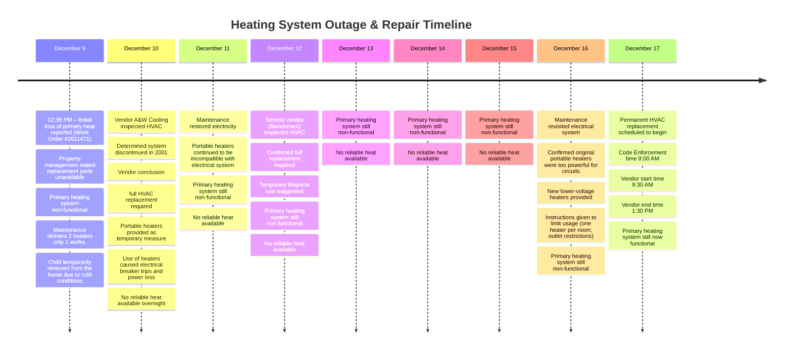

# Timelines

## **Overview**

We'll review the details in greater depth later, but for now, here are timelines of the major habitability issues we've faced.

## **Heating System Outage & Repair Timeline**

- **December 9**
  - Heat stopped working.
  - Maintenance indicated parts were unavailable and would need to be ordered.
  - Home became uninhabitable due to cold; **child was temporarily removed from the home**.
- **December 10**
  - Vendor **A&W Cooling** confirmed the unit was **discontinued in 2001**, requiring full replacement.
  - Temporary heaters were provided.
  - Temporary heaters caused **electrical issues**, including breaker trips.
  - Emergency maintenance requests were made; **no heat overnight**.
- **December 11**
  - Maintenance restored electricity, but **heat remained unavailable**.
- **December 12**
  - Second vendor (**Benchmark**) confirmed **full HVAC replacement required**.
  - No permanent heat restored.
- **December 13–15**
  - Home continued to have **no reliable heat**.
- **December 16**
  - Maintenance acknowledged the previously provided heaters were **too powerful for the electrical system**.
  - New heaters with lower voltage were provided.
  - Maintenance instructed:
    - Only **one heater per room**
    - **Do not use certain outlets**
- **December 17**
  - **Code Enforcement** inspection at 9:00 AM.
  - **Permanent HVAC Replacement** starts at 9:30 AM.
  - :star: Heat restored by 1:30 PM.

## **Water Repair & Timeline**
