# First Key Homes - Water 2

## **Overview**

:::caution Timeline
- **Start Date** 09/19/2025
- **End Date** Ongoing (73 Days)
:::

:::tip Shareholders
- Shana Shuford
- Kevin Walls
- Jason Shokunbi
- Mariola Schubbe 
- Hazel Aying
- India Pritchett
- Aurora Elliott
- Montier Elliott
  - 332.600.9573
  - montier.elliott@gmail.com
- Nia-Tara Hall-Byrd
  - 704.713.2422
  - nthall776@gmail.com
- **Vendors:** Swift Bros
- **Vendors:** Charlotte Plumbing
:::

### **Problem Statement**

Since the date July 1, 2025 the water utilities were transferred into the our name, the monthly water usage at the property increased dramatically and abnormally. Multiple First Key Homes representatives and several vendors have inspected the home, each one confirming evidence of a **water leak on the property's supply line**. Despite these confirmations, the issue has not been fully resolved, and we have incurred significant financial impact due to elevated water bills.

:::caution
Under **North Carolina landlord-tenant law (N.C.G.S. § 42-42(a)(2))**, the landlord must:

> **"Make all repairs and do whatever is necessary to put and keep the premises in a fit and habitable condition."**

A prolonged underground waterline leak is a **habitability and maintenance issue**, and failure to fix it promptly shifts financial burden unlawfully to us.
:::

**We need the following:**

1. **Written confirmation from a licensed plumber** that the leak is fully resolved, including the location and method of repair.
2. **A full correction and concession** of all excessive water charges resulting from the unresolved leak.
3. **Status update on the remaining credit balance** owed by First Key Homes.

<!--  -->
<!--  -->

## **Water Bills**

* **Average bill before July 1, 2025:** **$54.75/month**
* **Bills after leak detection period:**
  * July 1–Aug 8: **$372.74**
  * Aug 8–Sept 8: **$219.37**
  * Subsequent months continue to show elevated use

This represents increases as high as **291% month-over-month**.

$$
\begin{array}{l|r|r}
\textbf{Period} & \textbf{Amount (\$)} & \textbf{\% \Delta \text{ vs prev}} \\
\hline
\text{10/24} & 23.20 & - \\
\text{11/24} & 32.18 & +38.71\% \\
\text{12/24} & 25.50 & -20.76\% \\
\text{1/25} & 43.49 & +70.55\% \\
\text{2/25} & 42.98 & -1.17\% \\
\text{3/25} & 61.22 & +42.44\% \\
\text{4/25} & 85.00 & +38.84\% \\
\text{5/25} & 83.98 & -1.20\% \\
\text{6/25} & 95.18 & +13.34\% \\
\text{7/1/25 - 8/8/25} & 372.74 & +291.62\% \\
\text{8/8/25 - 9/8/25} & 219.37 & -41.15\% \\
\hline
\textbf{Average (before\ 7/1/25)} & \textbf{54.75} & \text{---} \\
\end{array}
$$

### **July 9th 2025**

**[PDF - Water Bill: July 9th 2025](../../static/water/3017WaterCharges7-1-25-7-9-25.pdf)**

<!--  -->

### **August 9th 2025**

**[PDF - Water Bill: August 9th 2025](../../static/water/3017WaterCharges7-9-25-8-8-25.pdf)**

<!--  -->

### **September 8th 2025**

**[PDF - Water Bill: September 8th 2025](../../static/water/3017WaterCharges8-8-25-9-8-25.pdf)**

<!--  -->

### **October 8th 2025**

**[PDF - Water Bill: October 16th 2025](../../static/water/3017WaterCharges8-8-25-10-15-25.pdf)**

<!--  -->

## **Communications**

- :email: August 4th 2025 - 24 minutes
- :phone: September 29th 2025 - 10 minutes
- :email: October 7th 2025 - Email
- :phone: October 9th 2025 
  - :phone: 8 minutes 
  - :email: Follow-up Shana Shuford Email
- :email: October 9th 2025 - Shana Shuford Email
- :phone: October 29th 2025 - 15 minutes 
- :phone: October 30th 2025 - Mariola Schubbe
  - :phone: 10:53 26 minutes
  - :phone: 11:42 53 minutes
  - :phone: 12:42 10 minutes   
- :email: October 30th 2025 - Email
- :phone: November 4th 2025 - Hazel Aying
- :phone: November 17th 2025 
  - :phone: 16 minutes
  - :email: Follow-up Email
- :phone: November 18th 2025 - 16 minutes
- :phone: November 19th 2025 - 10 minutes
- :phone: November 25th 2025 - 8 minutes
- :phone: December 1st 2025 - 19 minutes

### **Communication Timeline**

```mermaid
flowchart TD

    A1[📧 August 4, 2025<br/>24 min]

    B1[📞 September 29, 2025<br/>10 min]

    C1[📧 October 7, 2025<br/>Email]

    D1[📞 October 9, 2025]
    D1a[📞 8 min]
    D1b[📧 Follow-up<br/>Shana Shuford Email]

    E1[📧 October 9, 2025<br/>Shana Shuford Email]

    F1[📞 October 29, 2025<br/>15 min]

    G1[📞 October 30, 2025<br/>Mariola Schubbe]
    G1a[📞 10:53<br/>26 min]
    G1b[📞 11:42<br/>53 min]
    G1c[📞 12:42<br/>10 min]

    H1[📧 October 30, 2025<br/>Email]

    I1[📞 November 4, 2025<br/>Hazel Aying]

    J1[📞 November 17, 2025]
    J1a[📞 16 min]
    J1b[📧 Follow-up Email]

    K1[📞 November 18, 2025<br/>16 min]

    L1[📞 November 19, 2025<br/>10 min]

    M1[📞 November 25, 2025<br/>8 min]

    N1[📞 December 1, 2025<br/>19 min]

    %% Flow sequence
    A1 --> B1 --> C1 --> D1
    D1 --> D1a --> D1b
    D1 --> E1 --> F1 --> G1
    G1 --> G1a --> G1b --> G1c
    G1 --> H1 --> I1 --> J1
    J1 --> J1a --> J1b
    J1 --> K1 --> L1 --> M1 --> N1

```

Communication Timeline

## **Visits**

### **1. First Key Homes – Kevin Walls (Visit 1)**

* Confirmed leak at meter
* Directed us he would call plumber
* No repair completed

### **2. Charlotte Plumbing – SME Mike**

* Confirmed leak at meter
* Cut into wall to inspect HVAC area
* Found **no interior leaks**
* Recommended waterline inspection (underground)

### **3. Swift Bros – SME Mykola (Visit 1)**

* Confirmed leak at meter
* Turned off main valve
* Inspected crawl/under house: **no interior leak**
* Recommended waterline evaluation

### **4. First Key Homes – Kevin Walls (Visit 2)**

* Incorrectly reported water continued after shutoff
* Suggested replacing toilet components
* Created confusion due to contradictory findings
* Not aligned with licensed plumber findings

  
Request History

<!--  -->

### **5. Swift Bros – SME Mykola (Visit 2)**

* Replaced main valve to the home
* Leak persisted
* Confirmed again **no internal leak**

### **6. Last Vendor (Unidentified)**

* Arrived with excavator
* Did not identify himself or provide scope
* Began excavation on property
* Provided no update, no findings, and no written report

---

:::caution
All professional vendors located the issue **outside** the house. No one has provided written confirmation of repair or a final diagnosis, which NC law requires the landlord to provide to resolve habitability concerns.
:::

## **State of Union**

### **1. Licensed Plumber Verification (Mandatory)**

Provide a **written statement** from a licensed plumber confirming:

* The exact cause and location of the leak
* The work performed to repair the leak
* Confirmation that the leak is fully resolved
* Baseline water usage has returned to normal levels

### **2. Billing Concessions & Adjustments**

Issue a full concession for all excessive water usage from **July 1, 2025 through the date the leak is confirmed resolved**.

This includes:

* Water charges
* Sewer charges
* Stormwater charges
* Any late fees arising from inflated bills

### **3. Outstanding Credit Payment**

Confirm when the remaining **$477.16** credit will be applied to the tenant’s account.

:::danger **Expenditures**

- Per **Mariola Schubbe** we was suppose to be credited `$1,161.41` towards our rent for the water leak issue. We have only received `$684.25` to date.
- Per **Mariola Schubbe** we was suppose to have no late fees charged due to the water leak issue. We was charged a late fee on our November rent. This issue was resolved after contacting **Hazel Aying**.

---

- **Promised** $1,161.41
- **Paid** $684.25
- **Balance** $477.16
:::
