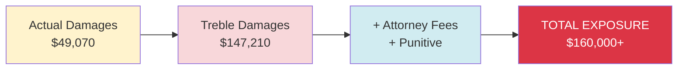

<!-- ## Critical Issues at a Glance

### Water Leak (July 2025 - Present)

| Metric | Value |
|--------|-------|
| Duration | 5+ months unresolved |
| Bill Increase | 580% ($54.75 → $372.74) |
| Total Excess Charges | $1,500+ |
| Promised Credit | $1,161.41 |
| Actual Credit | $684.25 |
| **Outstanding Balance** | **$477.16** |
| Service Calls | Multiple (leak NOT fixed) |
| Tenant Impact | Constant anxiety, financial drain |

### Heating System Failure (December 9-Present)

| Metric | Value |
|--------|-------|
| Failure Date | December 9, 2025, 12:36 PM |
| Duration Without Heat | 70+ hours (and counting) |
| Indoor Temperature | 57°F |
| Outdoor Temperature | 38°F (highs); 32°F (lows) |
| HVAC System Age | 24 years old (2001 manufacture) |
| Vendor Assessment | Full replacement required |
| FirstKey Response | Broken portable heaters |
| Heater Issues | Trip breaker, non-functional, WiFi disruption |
| 3-Year-Old Status | Had to be removed from home |

### Professional Impact (Montier Elliott - SVP, Bank of America)

- **Career Stage**: Recent promotion to Senior Vice President (critical transition)
- **Forced Absences**: 20+ hours waiting for contractors and repairs
- **Missing Meetings**: Unable to attend crucial leadership meetings
- **Credibility Risk**: Cannot explain absences to new team
- **WiFi Disruption**: Cannot work from home (heaters trip breaker)
- **Catch-22**: Can't go to office (waiting for service) AND can't work from home (no WiFi)
- **Financial Risk**: SVP compensation includes bonuses tied to visibility and performance
- **Estimated Damage**: $5,000-$10,000

## Legal Violations

### Primary Statutes

**N.C.G.S. § 42-42 - Implied Warranty of Habitability**
- Landlord must provide fit premises
- Essential services must work
- FirstKey failed on both counts

**N.C.G.S. § 42-38 - Landlord's Duty to Maintain**
- Must keep electrical, plumbing, heating working
- Must make prompt repairs
- FirstKey violated all requirements

**N.C.G.S. § 75-1.1 - Unfair and Deceptive Trade Practices**
- Pattern of broken promises
- False statements about credits
- Deliberate delay tactics
- **Treble (3x) damages available**

### Additional Claims

- Breach of Contract
- Breach of Covenant of Quiet Enjoyment
- Negligence
- Negligent Infliction of Emotional Distress
- Constructive Eviction
- Child Endangerment

## Damages Calculation

### Damage Breakdown

| Category | Amount |
|----------|--------|
| Water Leak Issues | $5,742 |
| Heating Failure | $2,928 |
| Professional Impact | $9,000 |
| Child Endangerment | $8,500 |
| Emotional Distress | $15,000 |
| Time & Effort | $4,900 |
| Miscellaneous | $3,000 |
| **Actual Damages** | **$49,070** |
| **Treble (3x)** | **$147,210** |

### Why Treble Damages Apply

**N.C.G.S. § 75-1.1 allows 3x damages for willful unfair or deceptive conduct:**

1. **Pattern of Broken Promises**
   - Hotel promised → not provided
   - Callbacks promised → not received
   - Credits promised → partially withheld
   - Repairs promised → not completed

2. **Bad Faith Customer Service**
   - 73+ days of case management with zero resolution
   - Repeated transfers between representatives
   - "Approval process" used indefinitely
   - No timeline ever provided

3. **Vendor Confirmation Ignored**
   - A&W Heating confirmed full replacement needed
   - FirstKey offered broken portable heaters instead
   - Knew correct fix but chose inadequate solution

4. **Knowing Child Endangerment**
   - 3-year-old in 57°F home
   - Refused hotel accommodation
   - Offered insufficient temporary solution
   - Continued delays despite child in home

5. **Deliberate Delay Tactics**
   - 5 months on water leak
   - 70+ hours on heating (and counting)
   - No urgency despite emergency conditions
   - "Approval process" excuse without timeline

## Settlement Demand

### Primary Offer
- **Cash**: $35,000
- **Outstanding Credit**: $477.16
- **HVAC Repair**: Begin within 7 days, complete within 14 days
- **Lease Termination**: Without penalty
- **Deposit Return**: Full amount with interest
- **Positive Reference**: Written letter

### Settlement Timeline
- **Deadline**: December 13, 2025, 8:00 PM
- **Payment**: Within 7 days of signed agreement
- **HVAC Work**: Begins immediately upon settlement
- **Lease End**: Upon HVAC completion or immediately (tenant choice)

### If No Settlement

**Legal Action Commences December 16, 2025:**

1. **Lawsuit Filing**
   - Request $147,210 treble damages
   - Additional punitive damages
   - Attorney fees reimbursement
   - Court costs

2. **Regulatory Complaints**
   - NC Real Estate Commission
   - Mecklenburg County Code Enforcement
   - Fire Marshal (electrical hazard)
   - Better Business Bureau

3. **Public Documentation**
   - Media contact
   - Online reviews (factual, not defamatory)
   - Community awareness
   - Professional network notification

4. **Court Process**
   - Small claims or superior court
   - Expected hearing: 30-60 days
   - Full discovery process
   - Potential mediation
   - Trial if necessary

## Key Strengths of Case

### Legal Strengths
✅ Multiple clear statute violations
✅ Written lease requiring habitable conditions
✅ Vendor documentation supporting necessary repairs
✅ 73+ days of documented communication
✅ Pattern of broken promises (strong evidence of bad faith)
✅ Child endangerment component (jury sympathy)

### Factual Strengths
✅ Perfect tenant payment history (3 years)
✅ Professional credibility (SVP at major bank)
✅ Extensive temperature and condition documentation
✅ Water bill spikes prove leak (objective evidence)
✅ Multiple service calls show landlord knowledge
✅ Vendor confirmation of necessary repairs

### Jury Appeal
✅ Sympathetic tenants (perfect payment history)
✅ Professional damages (SVP during promotion)
✅ Child safety issue (young child endangered)
✅ David vs. Goliath (individuals vs. property management company)
✅ Obvious bad faith (multiple broken promises)
✅ Excessive damages request justifies treble award

## Minimum Acceptable Terms

**Will NOT accept less than:**
- $25,000 cash
- Outstanding $477.16 credit paid
- Lease termination without penalty
- Full deposit return
- HVAC repair timeline with specific dates
- All terms in writing

**Deal Breakers:**
- Payment plans (need lump sum)
- Vague repair promises
- Continued tenancy without substantial rent reduction
- Non-disclosure preventing factual reviews
- Waiver preventing future claims if issues recur

## Immediate Next Steps

### This Week
1. **Send final demand letter** (today or tomorrow)
   - Via email and certified mail
   - 48-hour deadline
   - All legal basis explained

2. **Establish rent escrow** (today or tomorrow)
   - Open separate account
   - Place December rent ($2,855)
   - Send formal escrow notice to FirstKey

3. **Document evidence** (today/tomorrow)
   - Photos backed up (cloud, external drive)
   - Temperature log current
   - Communication log organized
   - Financial records compiled

### Next Actions (If No Settlement)
1. **Legal consultation** (attorney)
2. **Court filing preparation** (Monday Dec 16)
3. **Regulatory complaints** (Dec 16+)
4. **Public documentation** (if necessary)

## Conclusion

This is a strong case with clear legal violations, sympathetic tenants, and documented damages exceeding $147,000 with treble damages. FirstKey faces:

- Certain liability in court
- Likely treble damages award
- Attorney fees and court costs
- Regulatory complaints and fines
- Reputational damage
- Potential media coverage

**Settlement at $35,000 is significantly below court exposure and represents strong incentive to resolve before litigation.**

---

## Quick Navigation

- [Water Leak Details](/docs/01-overview/water-leak)
- [Heating Failure Details](/docs/01-overview/heating-failure)
- [Legal Violations](/docs/02-legal/violations)
- [Damages Breakdown](/docs/04-damages/calculation)
- [Settlement Options](/docs/05-settlement/demands)
- [Action Items](/docs/06-resources/action-items) -->

## Critical Timeline

| Date/Time              | Event                         | Status                |
| ---------------------- | ----------------------------- | --------------------- |
| Dec 9, 12:36 PM        | Heating failure discovered    | ❌ Emergency          |
| Dec 10, Morning        | Still no heat (24+ hours)     | 🚨 CRITICAL           |
| Dec 10, Multiple calls | Promised hotel, callbacks     | ❌ NOT PROVIDED       |
| Dec 10, Evening        | Portable heaters delivered    | ❌ BROKEN/INEFFECTIVE |
| Dec 11, Morning        | 70+ hours no functional heat  | 👶 CHILD ENDANGERED   |
| Dec 11, 3:30 PM        | "Wait for callback"           | ❌ NO CALL            |
| Dec 11, Evening        | Child removed from home       | 🚨 EMERGENCY          |
| **Dec 13, 8 PM**       | **Final settlement deadline** | ⏱️ 48 HOURS           |

## NC Building Code Violations

### International Property Maintenance Code

**Section 602.3 - Heating Systems:**

- Must be capable of maintaining 68°F during winter
- 57°F = clear violation
- Landlord must ensure compliance

**Section 505.1 - Plumbing:**

- Must be maintained safely
- Related electrical systems must not be hazardous
- Broken heaters + electrical issues = violation

**Section 605.1 - Electrical:**

- Must handle normal operation of appliances
- Breaker constantly tripping = hazard
- Fire risk from overloaded circuits

### Charlotte-Mecklenburg Specific

**Local Heating Requirements:**

- Minimum 68°F capability required
- Must be maintained by landlord
- Repairs must be prompt
- Emergency repairs = immediate

## Legal Strength

### Slam-Dunk Legal Case

**No reasonable argument FirstKey can make:**

1. ✅ Heating broken for 70+ hours (documented)
2. ✅ 57°F is uninhabitable (objective fact)
3. ✅ Landlord knew problem (vendor report)
4. ✅ Landlord knew solution (replacement needed)
5. ✅ Landlord offered inadequate solution (broken heaters)
6. ✅ Child endangered (removed from home)
7. ✅ Multiple broken promises (documented)
8. ✅ No timeline provided (still unknown)

**FirstKey liability is certain.**

### Jury Appeal

**Extremely sympathetic facts:**

- ✅ Perfect 3-year-old child in cold home
- ✅ Professional parents (SVP at major bank)
- ✅ Perfect payment history (3 years)
- ✅ Clear bad faith (vendor report ignored)
- ✅ Multiple broken promises
- ✅ Holiday season timing (added emotional impact)
- ✅ Emergency situation (70+ hours)

**Jury will be sympathetic to tenants.**

---

## Next Steps

### Immediate (Today/Tomorrow)

1. **Final Demand Letter**

   - Emphasize heating emergency
   - Detail broken promises
   - Cite child endangerment
   - Set 48-hour deadline

2. **Evidence Documentation**

   - Complete temperature logs
   - Final photos/videos
   - Back up all documentation
   - Organize for potential litigation

3. **Rent Escrow**
   - Place December rent in escrow
   - Send formal notice to FirstKey
   - Document the escrow account

### If Settlement Rejected

1. **Immediate Legal Action**

   - File lawsuit Dec 16
   - Request treble damages
   - Include child endangerment claim
   - Seek emergency injunctive relief for repairs

2. **Regulatory Complaints**

   - Code Enforcement (heating violation)
   - Fire Marshal (electrical hazard)
   - NC Real Estate Commission (professional negligence)

3. **Media Contact**
   - "SVP at Bank of America forced to remove child from home due to landlord negligence"
   - Strong media angle (sympathetic family + major bank connection)
